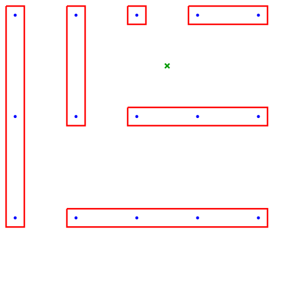

# The Problem


Suppose I have a finite evenly spaced (on both axes) grid of points on a plane (blue) and there are also "forbidden points" (green) that can be placed anywhere within this grid.

I want to draw axis-aligned rectangles around the blue points but not the green forbidden points.

How do I find the minimum number of rectangles it would take to enclose all the blue points?

# Possible Approaches
* Brute force: Put rectangles around each point, and stochastically pick pairs of rectangles to merge.

# Results
## First attempt at brute force
```python
for _ in range(2):
    for i in range(len(example_world.rectangles)):
        for j in range(len(example_world.rectangles)):
            if i == j:
                continue
            if j >= len(example_world.rectangles):
                break
            if i >= len(example_world.rectangles):
                break
            if can_merge(example_world.rectangles[i], example_world.rectangles[j], example_world):
                merge(example_world.rectangles[i], example_world.rectangles[j], example_world)
```
This algorithm gave me this terrible solution 